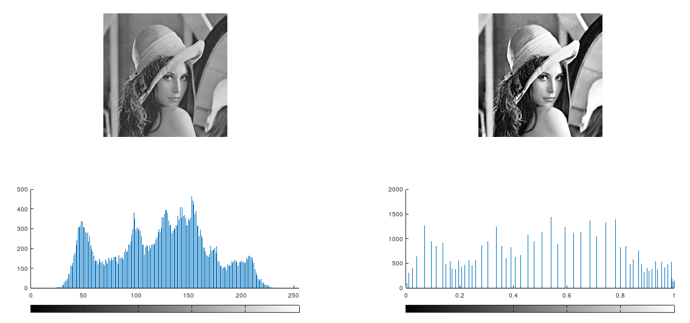
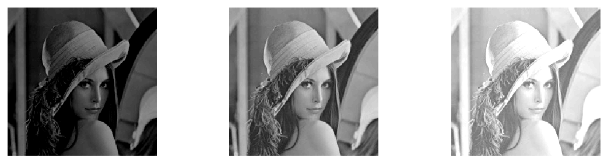
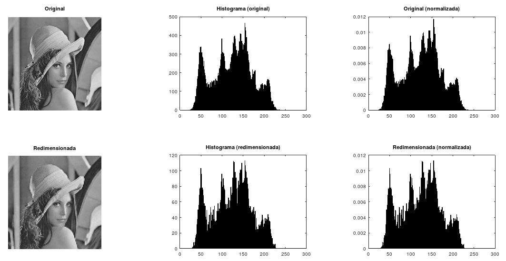
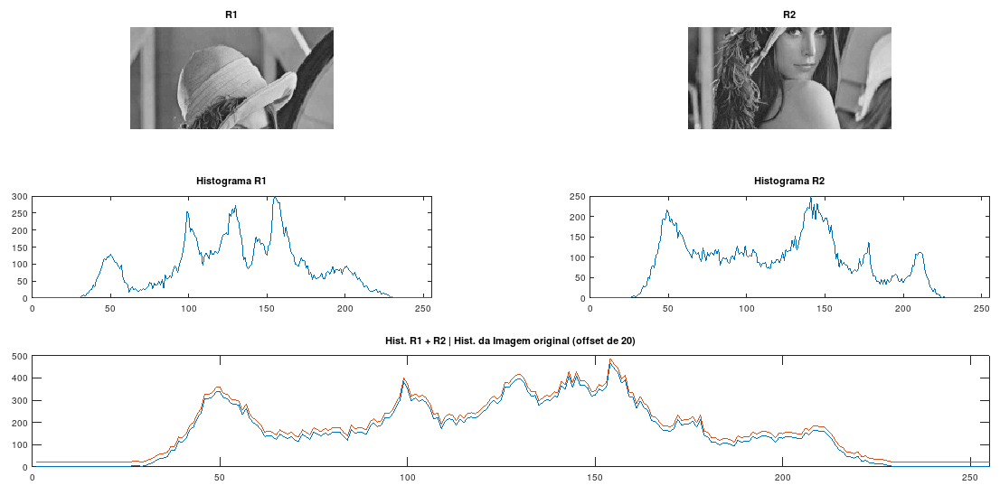
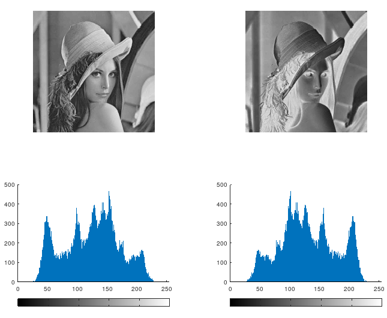
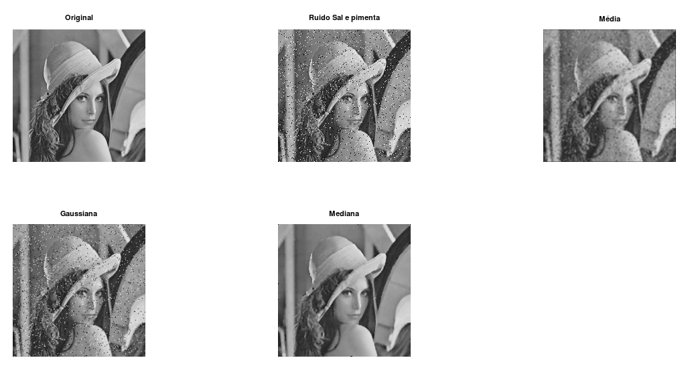

# Digital Image Processing IFCE BSI

## Installing Octave on Lubuntu

```bash
# Add the repository of Octave
sudo add-apt-repository ppa:octave/stable
sudo apt-get update

# Install Octave
sudo apt install octave octave-image
```

## Exercises

### 001 Images Operating

Criar uma função que receba duas imagens binárias e o tipo de operação ('AND', 'OR', XOR, div, prod, soma, dif) a ser executada entre essas duas imagens. Retornar o resultado e mostrar utilizando a função imshow.


### 002 Distance Pixels

Criar uma função que receba as coordenadas (x,y) e (s,t) de dois pixels de uma imagem e que calcule a distância entre eles. A função também deve receber o nome da distância (euclidiana, city block ou chessboard) e retornar o valor calculado.

```matlab
dist([3 3],[4 4],'euclidiana') ==> 1.4142
dist([3 3],[4 4],'cityblock')  ==> 2
dist([3 3],[4 4],'chessboard') ==> 1
```

### 003 Black White Distance

Criar uma imagem de tamanho M x N (pode ser uma matriz de zeros com apenas um pixel com valor igual a 1 e calcular a distância (Euclidiana, city block ou chessboard) do pixel de valor 1 em relação a todos os pixels da imagem. Mostrar a matriz de distância obtida com imshow e surf.


### 004 Gray and inverse

Ler uma imagem qualquer (com imread) e caso a imagem lida seja colorida, transformar para níveis de cinza (com rgb2gray). Por fim, obtenha o negativo da imagem em nível de cinza.


### 005 Histogram Equalization

Ler uma imagem qualquer, transformar para níveis de cinza e efetuar a equalização do histograma.



### 006 Image enhancement

Ler uma imagem qualquer, transformar para níveis de cinza e efetuar realces de bilho.



### 007 Normalize histograms

Ler uma imagem e obter outra imagem com a metade do número de linhas e colunas da imagem original (utilize imresize). Obter os histogramas normalizados dessas duas imagens e mostrar em janelas diferentes.



### 008 Histograms sum

Ler uma imagem e obter os histogramas de duas regiões (R1 e R2) dessa imagem, em que a união (R1 ∪ R2) das duas regiões consiste na imagem inteira. Em seguida, obter um histograma resultante somando os histogramas de R1 e R2 e compará-lo com o histograma obtido a partir da imagem completa.



### 009 Histograms of inverse

Obter o histograma de uma imagem qualquer. Em seguida obter o negativo desta imagem e o histograma correspondente. Compare e mostre os histogramas obtidos em janelas diferentes.



### 010 Filters Average, Gaussian and Median

Ler uma imagem qualquer (utilizando imread), aplicar ruído “sal e pimenta” (utilizando imnoise) e filtrar a imagem ruidosa com os filtros da média, da Gaussiana e da mediana com máscaras (ou janelas) de diferentes tamanhos (3 x 3, 5 x 5, 7 x 7). Para gerar as máscaras utilizar a função fspecial. Para realizar a convolução ou filtragem linear (média e gaussiana) utilizar a função filter2 ou conv2. Para a filtragem não linear da mediana utilizar a função medfilt2. Código disponibilizado. Verificar o tamanho da máscara e o filtro mais adequado.



### 011 Average by kernel

Ler uma imagem qualquer (utilizando imread) e filtrar essa imagem com o filtro da média
com máscaras (ou janelas) de diferentes tamanhos (3 x 3, 5 x 5, 7 x 7, 9 x 9). Para gerar as
máscaras utilizar a função fspecial e para realizar a filtragem ou convolução utilizar a função
filter2 ou conv2. Verificar o nível de suavização (ou borramento) na imagem.

### 012 Gausian Noise

Ler uma imagem qualquer (utilizando imread), aplicar ruído “gaussiano” (utilizando
imnoise) e filtrar a imagem ruidosa com os filtros da média, da Gaussiana e da mediana
com máscaras (ou janelas) de tamanhos 3 x 3 e 5 x 5. Para gerar as máscaras utilizar a função
fspecial. Para realizar a convolução ou filtragem linear (média e gaussiana) utilizar a função
filter2 ou conv2. Para a filtragem não linear da mediana utilizar a função medfilt2.