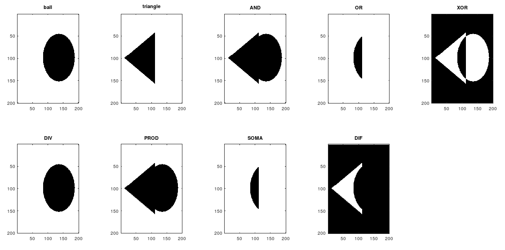
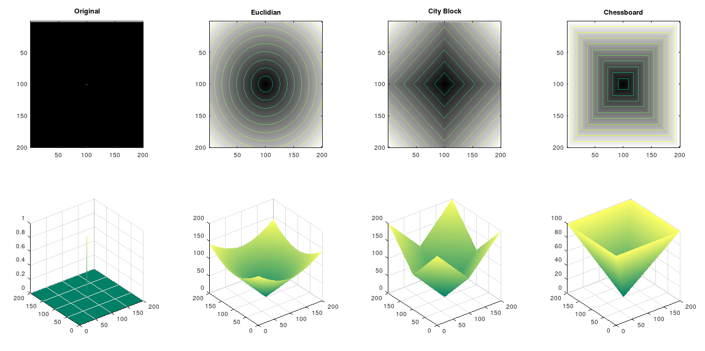
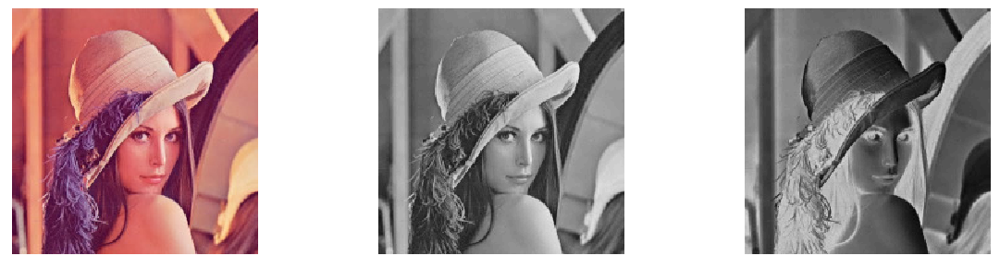

# Digital Image Processing IFCE BSI

## Installing Octave on Lubuntu

```bash
# Add the repository of Octave
sudo add-apt-repository ppa:octave/stable
sudo apt-get update

# Install Octave
sudo apt install octave octave-image
```

## Exercises

### 001 Images Operating

Criar uma função que receba duas imagens binárias e o tipo de operação ('AND', 'OR', XOR, div, prod, soma, dif) a ser executada entre essas duas imagens. Retornar o resultado e mostrar utilizando a função imshow.



### 002 Distance Pixels

Criar uma função que receba as coordenadas (x,y) e (s,t) de dois pixels de uma imagem e que calcule a distância entre eles. A função também deve receber o nome da distância (euclidiana, city block ou chessboard) e retornar o valor calculado.

```matlab
dist([3 3],[4 4],'euclidiana') ==> 1.4142
dist([3 3],[4 4],'cityblock')  ==> 2
dist([3 3],[4 4],'chessboard') ==> 1
```

### 003 Black White Distance

Criar uma imagem de tamanho M x N (pode ser uma matriz de zeros com apenas um pixel com valor igual a 1 e calcular a distância (Euclidiana, city block ou chessboard) do pixel de valor 1 em relação a todos os pixels da imagem. Mostrar a matriz de distância obtida com imshow e surf.



### 004 Gray and inverse

Ler uma imagem qualquer (com imread) e caso a imagem lida seja colorida, transformar para níveis de cinza (com rgb2gray). Por fim, obtenha o negativo da imagem em nível de cinza.


